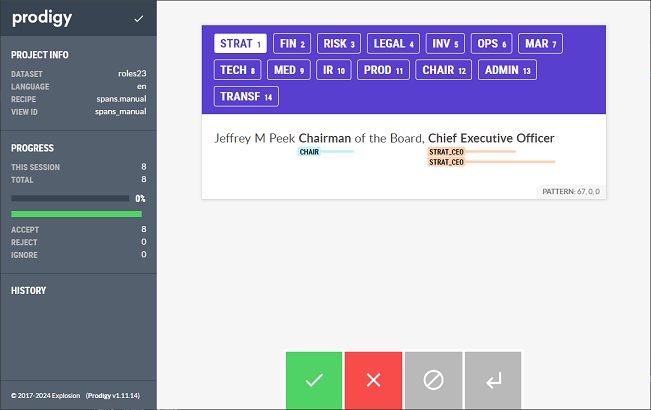

## README

1. Pre-label roles based on patterns specified in `patterns.jsonl` by running `pre_label_roles.py`

2. Verify pre-labeled roles using `prodigy`
```sh
python -m prodigy spans.manual {database} en_core_web_lg input/roles.jsonl --patterns patterns.jsonl --label STRAT_CEO,STRAT,FIN_CFO,FIN,RISK,LEGAL,INV,OPS,MAR,TECH,MED,IR,PROD,CHAIR,ADMIN,TRANSF
```



3. Manually inspect unlabeled roles using `prodigy` to derive additional patterns
```sh
python -m prodigy spans.manual {database} en_core_web_lg input/roles_unlabeled.jsonl --patterns patterns.jsonl --label STRAT_CEO,STRAT,FIN_CFO,FIN,RISK,LEGAL,INV,OPS,MAR,TECH,MED,IR,PROD,CHAIR,ADMIN,TRANSF
```

Classes:
1. STRAT_CEO
2. STRAT
3. FIN_CFO
4. FIN
5. RISK
6. LEGAL
7. INV
8. OPS
9. MAR
10. TECH
11. MED
12. IR
13. PROD
14. CHAIR
15. ADMIN
16. TRANSF
