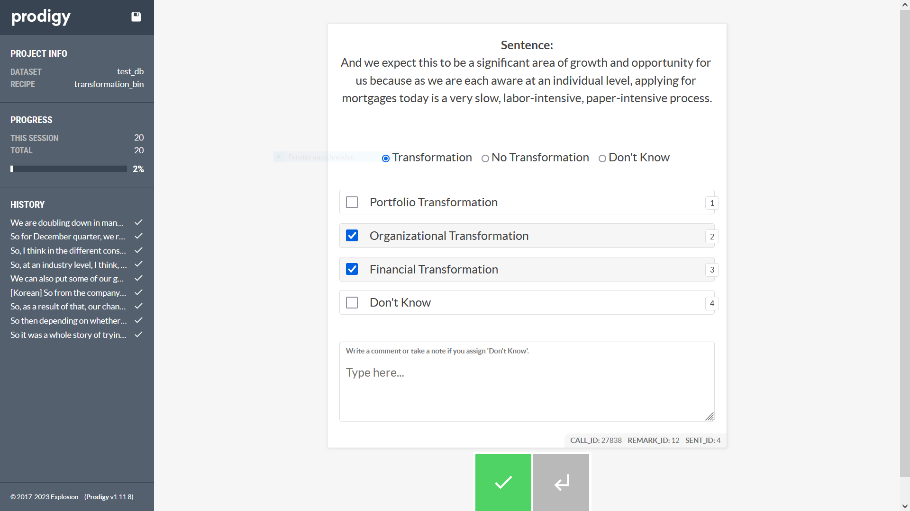
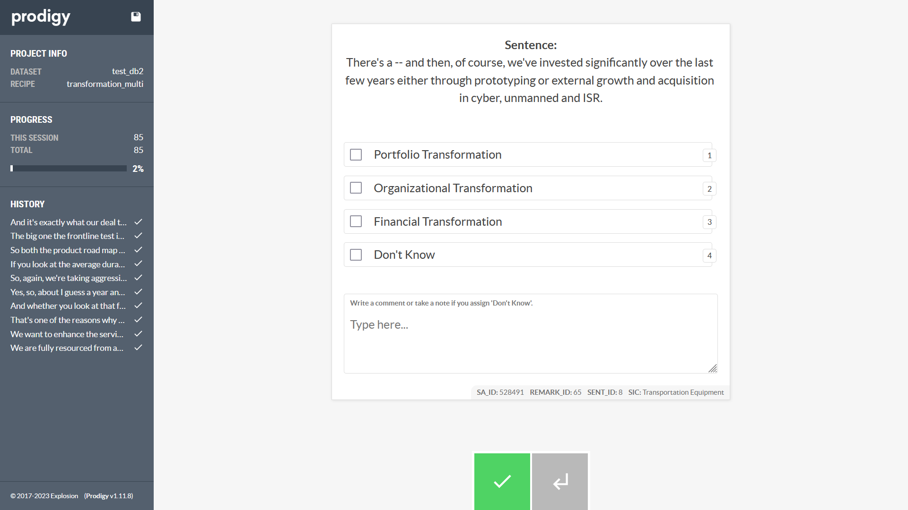

## README

First and second stage labeling of earnings call sentences. The first stage presents a binary, single-label classification task while the second stage presents a multi-class, multi-label classification task.



Second stage labeling only.



## Setup

1. Install [prodigy](https://prodi.gy/) using the licence key
```sh
python -m pip install prodigy -f https://{licence-key}@download.prodi.gy
```

2. Download and extract [ngrok](https://ngrok.com/)

3. Start multiple prodigy sessions on localhost
```sh
set PRODIGY_PORT=8080
python -m prodigy {prodigy.recipe} {database} input/{filename}.jsonl -F {script}.py
```
```sh
set PRODIGY_PORT=8081
python -m prodigy {prodigy.recipe} {database} input/{filename}.jsonl -F {script}.py
```
```sh
set PRODIGY_PORT=8082
python -m prodigy {prodigy.recipe} {database} input/{filename}.jsonl -F {script}.py
```

4. Execute `ngrok.exe`

5. Authenitacte with ngrok
```sh
ngrok config add-authtoken {authtoken} --config ngrok.yml
```

6. Start ngrok tunnels to expose local ports
```sh
ngrok start --config ngrok.yml --all
```

8. Save/export annotated examples
```sh
python -m prodigy db-out {database} output
```

## Prodigy Commands

View stats and list all datasets
```sh
python -m prodigy stats -l
```

Delete dataset from database
```sh
python -m prodigy drop {database}
```
